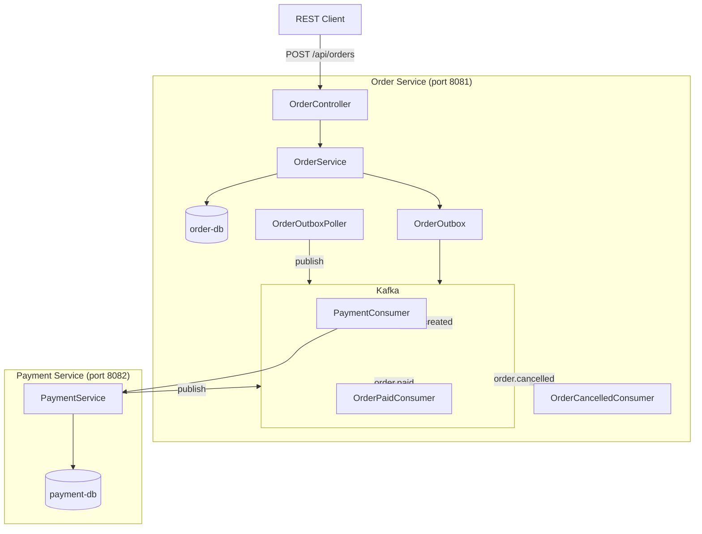

# 🛒 실시간 주문/결제 플랫폼 (MSA Order & Payment)

> **백엔드 포트폴리오** — MSA 기반 실시간 주문/결제 플랫폼

MSA(Microservice Architecture) 기반의 실시간 주문/결제 처리 플랫폼입니다. Kafka를 통한 이벤트 드리븐 아키텍처와 Saga 패턴으로 분산 트랜잭션을 처리합니다.

---

## 🏗️ 아키텍처



## 🔧 기술 스택

| 계층 | 기술 |
|------|------|
| 언어 | Kotlin 2.0 |
| 프레임워크 | Spring Boot 3.3, Spring Kafka |
| 메시징 | Apache Kafka (KRaft) |
| DB | PostgreSQL 16 (per service) |
| 빌드 | Gradle 9.5 (Multi-module) |
| 인프라 | Docker Compose |

## 📊 패턴 & 흐름

### Saga (Choreography) 패턴

```
Order Created → Kafka(order.created) → Payment Service
    ├─ 성공 → Kafka(order.paid) → Order Service (mark PAID)
    └─ 실패 → Kafka(order.cancelled) → Order Service (mark CANCELLED)
```

### Outbox 패턴
메시지 발행을 DB 트랜잭션과 함께 묶어 **Exactly-Once** 의미론을 보장합니다. Outbox Poller가 주기적으로 미발행 이벤트를 Kafka로 전송합니다.

## 🚀 실행 방법

```bash
# 1. 모든 서비스 실행 (Kafka + 2 PostgreSQL + 2 Spring Boot)
docker-compose up -d

# 2. Order Service 실행
cd order-service && ../gradlew bootRun &

# 3. Payment Service 실행
cd payment-service && ../gradlew bootRun &

# 4. 주문 생성
curl -X POST http://localhost:8081/api/orders \
  -H "Content-Type: application/json" \
  -d '{"productId":"P001","quantity":2,"amount":50000}'

# 5. 주문 상태 확인
curl http://localhost:8081/api/orders/1
# → {"status": "PAID"}
```

## 🧪 E2E 테스트

```bash
./scripts/e2e-test.sh
# ✅ 성공 시나리오: 주문 → 결제 완료 → PAID
# ❌ 실패 시나리오: 주문 → 잔액 부족 → 보상 트랜잭션 → CANCELLED
```

## 🧠 핵심 설계 결정

### 1. Saga (Choreography)
오케스트레이터 없이 각 서비스가 이벤트를 발행/구독하는 Choreography 방식을 선택했습니다. 서비스 간 결합도를 낮추고 장애 전파를 방지합니다.

### 2. Transactional Outbox
DB 트랜잭션 내에서 Outbox 이벤트를 저장하고, 별도 Poller가 발행합니다. Kafka 장애 시에도 메시지 유실이 없습니다.

### 3. Database per Service
각 서비스가 독립된 DB를 사용하여 MSA의 핵심 원칙인 데이터 분리를 실천합니다.
